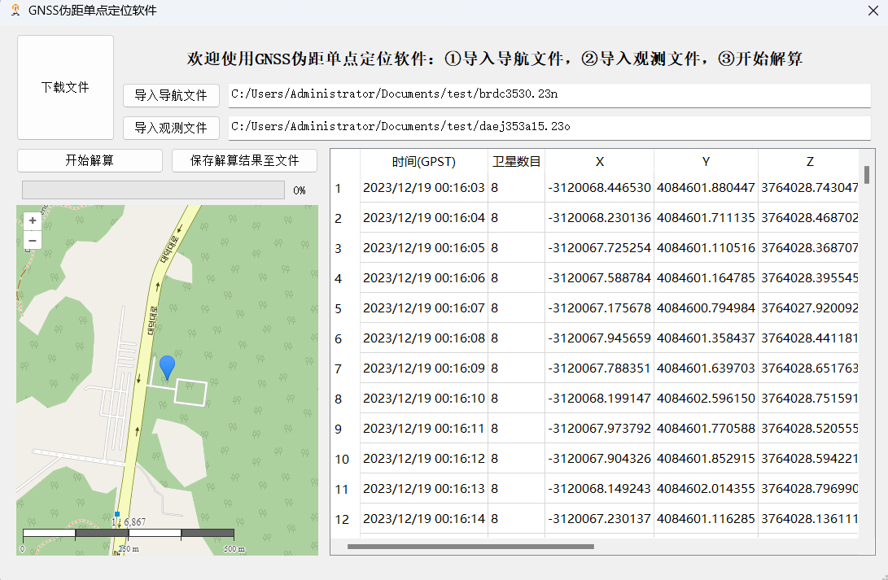

# 伪距单点定位可视化软件

## 简介

伪距单点定位可视化软件是一款高精度的地理定位解决方案，专为需要精确定位的应用设计。本软件结合了先进的地理定位技术和直观的可视化界面，能够在多种全球导航卫星系统（GNSS）如GPS、GLONASS、BDS、GAL等的支持下，提供精确的定位服务。

## 特点

1. **OSM地图可视化**: 利用开源的OSM（OpenStreetMap）地图，为用户提供直观、详细的定位可视化地图。

2. **高级解算算法**: 使用间接平差方法进行定位计算，结合自研的解算算法，支持多种GNSS组合解算，增强了解算的灵活性和准确性。

3. **电离层和对流层误差校正**: 采用klobuchar电离层误差模型和Saastamoinen对流层误差模型，有效减少环境因素对定位精度的影响。

4. **定位精度**: 在理想条件下，定位精度可达10米以内，适用于各种高精度定位需求。

## 安装和使用

请按照以下步骤进行软件的安装和启动：

1. 确保安装了Qt和Qt Creator。
2. 克隆本项目的代码仓库。
3. 在Qt Creator中打开项目文件。
4. 根据Qt Creator的提示进行编译和运行。

## 应用截图

## 贡献

欢迎对本软件进行贡献。如果您有任何建议或改进意见，请通过Issue或Pull Request与我联系。

## 许可

本软件遵循MIT许可协议。详情请参阅LICENSE文件。
